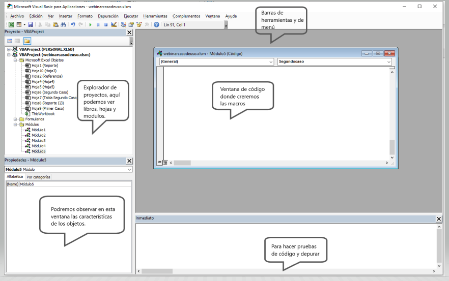

# Webinar -  MacroMando.xlsm

## Índice

- [Webinar -  MacroMando.xlsm](#webinar----macromandoxlsm)
  - [Índice](#Índice)
  - [1. ¿Por qué aprender macros?](#1-por-qué-aprender-macros)
  - [2. Requisitos Previos](#2-requisitos-previos)
  - [3. Que Tener en Cuenta al Crear una Macro](#3-que-tener-en-cuenta-al-crear-una-macro)
    - [Con que elementos podrían tener interactividad las macros](#Con-que-elementos-podrían-tener-interactividad-las-macros)
  - [4. Que es una Macro](#4-que-es-una-macro)
  - [5. Tipos de archivos](#5-tipos-de-archivos)
    - [Configurar Pestaña Programador](#configurar-pestaña-programador)
  - [6. Seguridad de Macros](#6-seguridad-de-macros)
  - [7. Grabadora de Macros](#7grabadora-de-macros)
  - [8. Tipos de referencias](#8-tipos-de-referencias)
    - [Referencia Absoluta](#referencia-absoluta)
    - [Referencia Relativa](#referencia-relativa)
  - [9. Maneras de ejecutar macros](9.-maneras-de-ejecutar-macros)
  - [10. Primer Caso de Uso](#10-primer-caso-de-uso)
  - [11. Primer Caso de Uso](#11-primer-caso-de-uso)
  - [12. VBA](#12-VBA)
  - [13. VBE](#13-VBE)
  - [14. Modelos de Objetos en Excel, Propiedades y Métodos](#14-modelos-de-objetos-en-excel-propiedades-y-Métodos)
    - [Propiedades y Métodos](#propiedades-y-Métodos)
      - [Propiedades](#Propiedades)
      - [Métodos](#Métodos)
  - [15. Propiedades y Métodos más Usados en Excel](#15-propiedades-y-Métodos-mas-usados-en-excel)
  - [16. Ejemplos de Validación de Códigos](#16-ejempos-de-Validación-de-Códigos)

# 1. ¿Por qué aprender macros?

- Usuario en Excel avanzado Y quiera pasar al siguiente nivel.
- Automatizar o hacer más eficiente el trabajo.
- Aprender un leguaje nuevo (VBA) es un lenguaje orientado a las aplicaciones de office o AutoCAD.
- Solicitud de reporterita automatizada.
- Conexión a otra aplicación de office, PowerPoint, Word..etc  (se tiene cierto nivel de conexión vía macros).

[Índice](#Índice)

# 2. Requisitos Previos

- Manejar y conocer temas sobre celdas, Rangos, tablas, navegar entre hojas de cálculos y otros archivos.
- Manejo del Ribbon de Excel (Menú o cinta de opciones).
- Conocer las Fórmulas y funciones del Excel. 

[Índice](#Índice)

# 3. Que Tener en Cuenta al Crear una Macro

- Las macros son un estilo de aplicaciones que se ejecutan mediante el lenguaje de VBA, antes de crear una macro se debe conocer para quien va dirigida y si es para un tercero debemos tener en cuenta:
  

## Con que elementos podrían tener interactividad las macros

# 4. Que es una Macro

- Una macro es un fragmento de código VBA que se puede ejecutar cuando sea necesario, existen macros grabadas y escritas en código desde 0, la diferencia de estas dos es que la primera al ser grabada se convierte en solo una serie de pasos cortos de comandos, en cambio a la segunda ya le podremos integrar mayor lógica y condiciones adicionales.

[Índice](#Índice)

# 5. Tipos de archivos

- Contamos con tres tipos de extensiones para los archivos de Excel, la primera extensión es en la que se guardan libros de la versión 2003 conocida como .xls, para una mejor seguridad y buenas prácticas a partir del 2007 en adelante se realizó la separación de los paquetes de macros con el resto de los paquetes generando así dos nuevas extensiones la .xlsx que es la de documentos que guardamos actualmente y la .xlsm que hacen referencia a los libros que contienen macros.

##  Configurar Pestaña Programador 

- Antes de iniciar con nuestro tema de macros debemos activar la pestaña en el ribbon donde están las herramientas que se usaran para este tema, el paso a paso será lo mismo para todas las versiones, lo único que cambiara es que en la versión del 2013 esta pestaña no se llama programador si no desarrollador.

- Pasos para activar la pestaña programador:

[Índice](#Índice)

# 6. Seguridad de Macros

- Antes de habilitar un documento macro debemos verificar que venga de un origen seguro ya que al usar el lenguaje VBA puede tener virus malicioso, antes de habilitamos contenido, opciones avanzadas en archivo, configuración centro de confianza, barras de mensajes, mostrar la barra de mensajes, opción configuración de macros.

Par mayor seguridad al momento de manejar macros debemos asegurarnos que estas opciones estén habilitadas en la opción de seguridad con el fin de evitar que se ejecuten comandos o códigos no aprobados.

ActiveX: son los controles tipo botón, cuadro de texto y Combo Box

[Índice](#Índice)

# 7. Grabadora de Macros

- Es la herramienta que nos permite grabar los comandos o acciones que deseamos ejecutar en cualquier momento

- - Cuando seleccionamos la opción grabar macro nos aparecerá la opción de Nombre de la macro, método abreviado, guardar macro y la parte de la descripción.

### Nombre:
- podemos colocar e nombre de nuestra preferencia se recomienda que sea un nombre corto que resuma que acción final tiene la acro, no puede contener espacios ni caracteres especiales.

### Método abreviado:
- Es una manera de activar nuestras macros por medio de comandos para hacer mucho más rápida su ejecución, se recomienda no colocar funciones simples ( ctrl + (letra) ) ya que como Excel cuenta con varios comandos por defecto podría ser sobrescritos por las macros, procurar usar comandos adicionando la tecla shift para que el resultado final sea (ctrl + mayús + (letra))

### Guardar Macro

- Esta es la opción que nos permite configurar las macros para que se puedan ejecutar sea en libros nuevos, únicamente en un libro específico o en cualquier libro de Excel que tengamos.

[Índice](#Índice)

# 8. Tipos de referencias

- Existen dos tipos de referencias: relativas y absolutas. Las referencias relativas cambian cuando se copian de una celda a otra. Por otra parte, las referencias absolutas se mantienen constantes sin importar la celda en que se copien.

## Referencia Absoluta:

- Esta referencia la utilizaremos si queremos que la macro se ejecute en una celda en específico junto con su resultado. 

## Referencia Relativa:

- Esta referencia la utilizaremos si queremos que la macro se ejecute en cualquier rango o celda que seleccionemos.

- En el siguiente video se podrá visualizar las diferencias entre estas dos opciones y por qué cada una podría ser aplicada para diferentes casos. 

- En los videos anteriores donde veíamos como crear cada referencia se veía el proceso pero al mirar este ejemplo podemos ver que si le adicionara dos columnas más a la base y ejecutara la sentencia absoluta sobre escribiría mis datos ya que al grabarla de esta manera la macro entiende que siempre tendrá que poner el total en la misma celda en este caso E5 en cambio al ejecutar la relativa podremos observar que este total siempre quedara una columna después de la base ya que al tomarla como relativa se le indica un valor de rango en este caso es que siempre se ejecute una fila después de la última columna de la base (No se le condiciona una celda donde deba ejecutarse por obligación).

[Índice](#Índice)

# 9. Maneras de ejecutar macros

Tenemos Varias opciones para poder ejecutar nuestras macros algunas de ellas son:

-  La primera opción sería con la que hemos trabajado normalmente, atreves de nuestra pestaña programador podremos acceder a la opción de macros seleccionar la que deseamos y seleccionamos la opción ejecutar.

- La segunda opción puede ser un procedimiento similar al anterior en el que seleccionamos la pestaña vista y después la opción de macros seleccionar la que deseamos y seleccionamos la opción ejecutar.

 
- Para nuestra tercera opción tenemos los comandos del teclado que podemos configurar cuando vamos a grabar la macro.

- Si la macro es para la automatización de una tarea recurrente lo que podemos crear es un acceso rápido este se puede configurar ingresando por la pestaña archivos - opciones - Barra de herramientas de acceso rápido - seleccionamos en comandos disponibles (macros) - seleccionamos la macro que queremos que quede para ejecución - seleccionamos agregar y podemos configurarla para colocarle el icono o símbolo que deseamos y por último aceptar.

- Otra manera de Organizar nuestras Macros y ejecutarlas en un mejor orden es configurar la cinta de opciones (Ribbon) para poder crear una pestaña solo para nuestras macros o accesos rápido que usemos más frecuentes y esta activación se puede realizar ce una forma muy parecida a la anterior ingresando por la pestaña archivos - opciones - personalizar cinta de opciones- en la parte de la derecha seleccionamos el botón nueva pestaña, le asignamos un nombre y en la parte izquierda en comando disponibles seleccionamos la opción de macros - seleccionamos la macro que deseamos que se  ejecute - seleccionamos agregar y por ultimo aceptar.

- Por último, tenemos la opción que se ejecute mediante una figura, forma o botón esta alternativa es muy practica cuando deseamos realizar formularios o diseños prácticos de reporterita para que sea más fácil de ejecutar para el usuario final que consumirá el reporte.

[Índice](#Índice)

# 10. Primer Caso de Uso

- En este caso se grabará una macro con referencia absoluta para mostrar como ejecuta los comandos exactamente como nosotros los realizamos, es importante tener en cuenta que estos pasos deben estar bien estructurados.

# 11. Primer Caso de Uso

- En este proyecto grabaremos una macro con la combinación de referencia absoluta y relativa para mostrar cómo podemos hacer que los datos de una hoja pasen a otra y vayan quedando almacenados en forma tabular quiere decir en filas y columnas como las bases de datos.

Se debe tener cuenta que cuando se realizan procesos con la referencia relativa en mejor utilizar comandos de teclado para grabar los pasos, por ejemplo cuando pasamos a la segunda hoja a pegar los datos para que se seleccione la celda dejado de título utilizamos ctrl+(flecha hacia abajo) y luego nuevamente flecha hacia abajo.

# 12. VBA

[Índice](#Índice)

# 13. VBE

El editor de VBE lo podemos activar mediante la opción que esta en la pestaña programador llamada Visual Basic o por el comando Alt + F11

# 14. Modelos de Objetos en Excel, Propiedades y Métodos 

### Objetos en Excel: 

*-* Workbook:  Libro o documento en el que estamos trabajando.

*-* Worksheet:  Hoja en la que se está trabajando.

*-* Range/Cell: rango o celda.

Es muy importante saber que en el momento que se está ya digitando el código después de cada objeto debe ir el signo del punto (.)

Ejemplo de Jerarquías de objetos, de lo particular a lo general

Hacer referencia a celdas:

- Rabger("A1").Select

 Hacer referencia a hoja y celda:

- Worksheets("Hoja1").Range("A1").Select

Referencia un archivo, hoja y celda:

- WorkBooks("Libro1.xlsx").Worksheets("Hoja1").Range("A1").Select

Referencia desde una aplicación

- Application.WorkBooks("Libro1.xlsx").Worksheets("Hoja1").Range("A1").Select

### Ejemplo de Objetos:

## Propiedades y Métodos

## Propiedades

Las propiedades se pueden entender por las características de los objetos, un ejemplo puede ser un celular sus propiedades podrían ser tamaño, peso, color, pixeles, almacenamiento .... etc.

## Métodos

Los métodos se pueden entender por las acciones de los objetos, un ejemplo que podríamos usar como en el anterior podría ser el celular hacer llamadas, enviar mensajes, tomar fotos, abrir aplicaciones .... etc 

### Ejemplo de Propiedades y Métodos

En la siguiente imagen podemos ver un ejemplo de cómo deberíamos llamar las propiedades o métodos en el lenguaje VBA en este caso el objeto es Smartphone seguido del signo punto (.) para llamar la propiedad o método

[Índice](#Índice)

# 15. Propiedades y Métodos más Usados en Excel

## Ejemplos de aplicación de Propiedades y Métodos 

En este ejemplo podemos ver como llamamos al objeto Application y con el signo punto le indicamos el siguiente objeto ThisWorkbook (Esta hoja) y la propiedad Name (nombre) quiere decir que queremos saber el nombre de la hoja actual que estamos editando

*-* Nota: si queremos que la información aparezca e la consola inmediato debemos utilizar Debug.Print o directamente escribir en esta función el fragmento del código iniciando con el signo de interogación (?) seguido de Application.ThisWorkbook.Name como se observa en la parte inferior de la imagen 

# 16. Ejemplos de Validación de Códigos 

Para validar que hace un código lo que se puede es abrir el VBE y ajustarla en la parte derecha que se pueda en la izquierda observar el libro donde se ejecuta la macro y mediante la techa F8 recorre por fracción de código que hace cada línea. 

Para sugerencias,dudas o peticiones contactar a los siguientes correos (Equipo IA DataPro):

*angie.jejen@finanzauto.com.co*

                                                    2023 © DataPro
